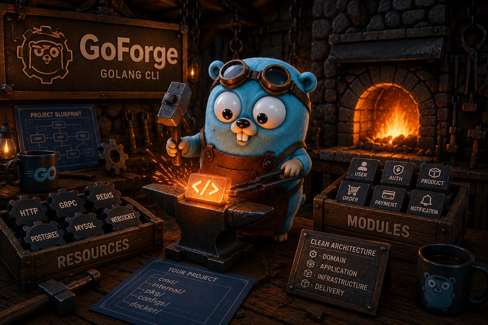

<div align="center">
  
</div>

<h1 align="center">🔨 GoForge</h1>

GoForge is an open-source CLI that scaffolds modern Go applications with a production-ready architecture.

Instead of manually creating folders, wiring dependencies, configuring HTTP servers, or repeating the same project setup, GoForge generates a clean foundation so you can immediately focus on your business logic.

> Generate production-ready Go applications in minutes, not hours.


<div align="center">

[Quick Start](/docs/getting-started.md)⛔•
[Installation](/docs/installation.md)⛔•
[Commands](/docs/commands.md)⛔•
[📄 Blueprint](/docs/blueprint.md) •
[ Modules](/docs/modules.md)⛔•
[🌐 Resources](/docs/resources.md) •
[🏛️ Architecture](/docs/architecture.md) •
[Templates](/docs/templates.md) ⛔ •
[Examples](/docs/examples.md) ⛔ •
[Roadmap](/docs/roadmap.md) ⛔•
[FAQ](/docs/faq.md) ⛔

</div>

<h2 align="center">✨ Features</h2>

<div align="center">

• 🗄️ Database resources (MySQL, PostgreSQL...)<br>
• 📁 Production-ready project structure<br>
• 🏛️ Clean Architecture scaffolding<br>
• ⚡ Redis support *(coming soon)* <br>
• 🧱 Extensible resource system<br>
• 🌐 HTTP server generation<br>
• 🔁 Idempotent generation<br>
• 🐳 Docker configuration<br>
• 🧩 Module generation<br>
• 🔌 WebSocket support<br>
• 📄 YAML Blueprint<br>

</div>

---

<h2 align="center">🚀 Quick Start</h2>

In most cases, creating a new project only takes three commands:

```bash
goforge init myapp
cd myapp
goforge add  http       #or any others resources / modules
goforge setup
```

GoForge reads your `blueprint.yaml` and generates the complete project structure.

---

<h2 align="center">⚙️ Installation</h2>

GoForge is currently under active development.

```bash
# Coming soon
go install github.com/b-souhail/goforge@latest
```

---

<div align="center">
<h2>📅 Roadmap</h2>

|       Version      |       Status      |       Date      |
| :----------------: | :---------------: | :-------------: |
|   🎂 **MVP Beta**  | 🔨 In Development | **17 Jul 2026** |
| 🚀 **Public Beta** |     📋 Planned    | **17 Aug 2026** |
|  ⭐ **Stable v1.0** |       ⏳ TBD       |     Unknown     |

</div>

---
<div align="center">
<h2>📚 Documentation</h2>

| Document           | Description                          |
| ------------------ | ------------------------------------ |
| 🚀 Getting Started | Create your first project            |
| ⚙️ Installation    | Install and build GoForge            |
| 📖 Commands        | Complete CLI reference               |
| 📄 Blueprint       | YAML configuration reference         |
| 🧩 Modules         | Module generation                    |
| 🌐 Resources       | HTTP, databases, Redis, WebSocket... |
| 🏛️ Architecture   | Generated project architecture       |
| 📦 Templates       | Template system                      |
| 💡 Examples        | Example projects                     |
| 🗺️ Roadmap        | Upcoming features                    |
| ❓ FAQ              | Frequently asked questions           |

</div>

---

<h2 align="center">🤝 Contributing</h2>

GoForge is an open-source side project and contributions are always welcome.

Whether you're fixing a bug, improving the documentation, proposing a new resource, or suggesting architectural improvements, every contribution helps the project grow.

---

<h2 align="center">📄 License</h2>

Released under the **MIT License**.
